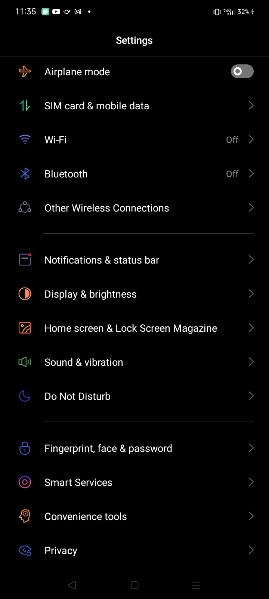
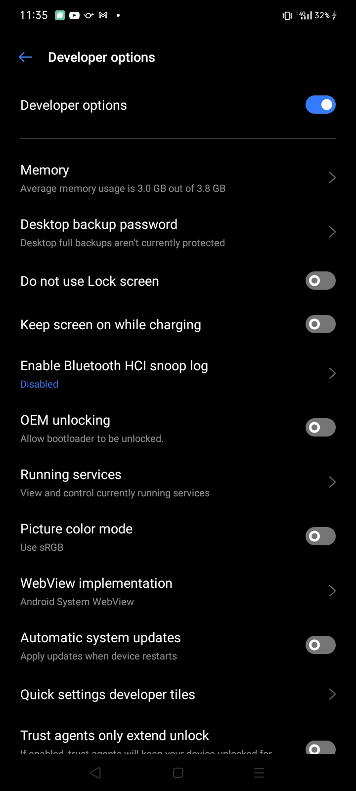
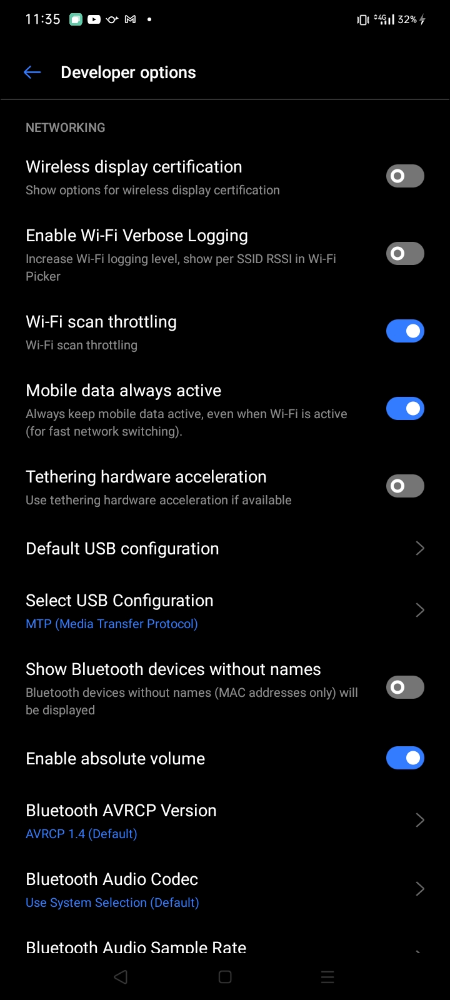
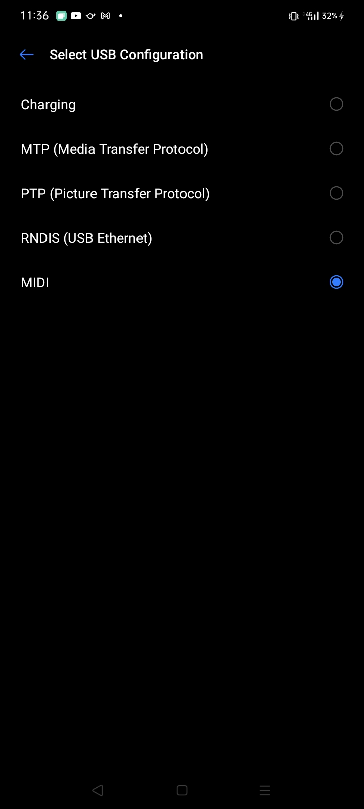
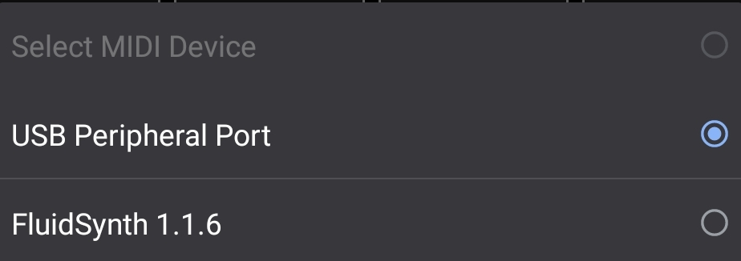
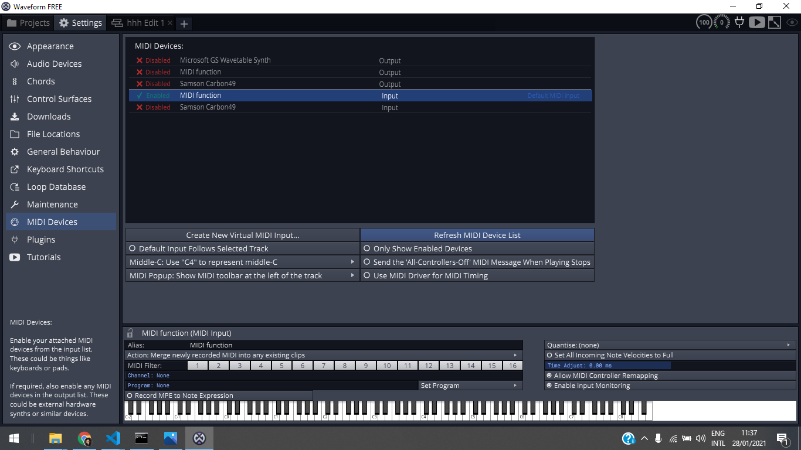

<h1>MIDI CONTROLLER</h1>
        

<h2>
What is this?
</h2>

This is a Progressive Web Application that can turn your device into a 
<a href="https://en.wikipedia.org/wiki/MIDI">MIDI</a> Controller using Web Technology

<h2>What can I do with this?</h2>

You need a MIDI output device or any software / app that can create virtual MIDI connection to make this work. 
Example : <a href="https://play.google.com/store/apps/details?id=net.volcanomobile.fluidsynthmidi&hl=en&gl=US" target="_blank">FluidSynth</a>
 
And if your device is running Android 6 or above, you can use it to control your <a href="https://en.m.wikipedia.org/wiki/Digital_audio_workstation" target="_blank">DAW</a>
using USB connection like these apps: <a href="https://play.google.com/store/apps/details?id=de.humatic.tdaw&hl=en&gl=US" target="_blank">TouchDAW</a>, <a href="https://play.google.com/store/apps/details?id=com.seemayr.midicontroller&hl=en&gl=US" target="_blank"> MIDI Controller</a>

How?

<figure>
<figcaption><b>Go to Setting</b></figcaption>

</figure>
 
<figure>
<figcaption><b>Find Developer Options</b></figcaption>

</figure>
 
<figure>
<figcaption><b>Scroll down to the Networking section</b></figcaption>

</figure>
 
<figure>
<figcaption><b>Tap on Select USB Configuration and set it to MIDI</b></figcaption>

</figure>
 
<figure>
<figcaption><b>In your web app tap on MIDI Device option  
Normally it would be registered as USB Peripheral Port
</b></figcaption>

</figure>
 
<figure>
<figcaption><b>Make sure to enable it on your DAW, the name could be different for every device</b></figcaption>

</figure>

